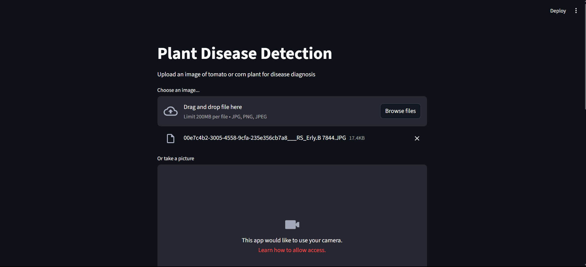
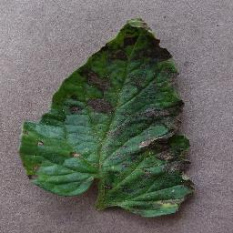
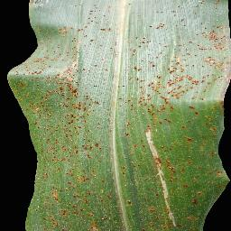
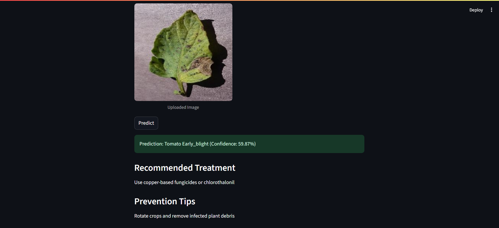
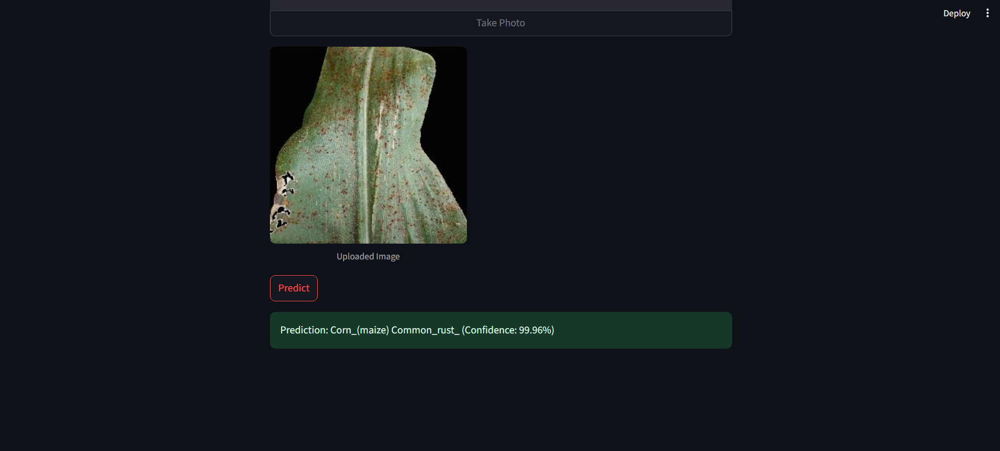

# Plant Disease Detection System

A machine learning-powered web application for detecting diseases in tomato and corn plants using computer vision and deep learning.




## 🌱 Overview

This project provides an automated solution for identifying plant diseases in agricultural crops. Using a ResNet-50 based convolutional neural network, the system can accurately classify healthy and diseased plants, helping farmers and agricultural professionals make informed decisions about crop management.

## 🎯 Features

- **Real-time Disease Detection**: Upload images or use camera to get instant disease diagnosis
- **Multi-crop Support**: Currently supports tomato and corn plants
- **Treatment Recommendations**: Provides specific treatment and prevention advice for detected diseases
- **User-friendly Interface**: Clean, intuitive Streamlit-based web interface
- **High Accuracy**: Deep learning model trained on agricultural image datasets

## 🔍 Supported Diseases

### Tomato Diseases
- **Late Blight**: Caused by *Phytophthora infestans*
- **Early Blight**: Caused by *Alternaria solani*
- **Healthy Tomato**: Normal, disease-free plants

### Corn Diseases
- **Common Rust**: Caused by *Puccinia sorghi*
- **Healthy Corn**: Normal, disease-free plants

## 🚀 Getting Started

### Prerequisites

- Python 3.8 or higher
- CUDA-compatible GPU (optional, for training)

### Installation

1. **Clone the repository**
   ```bash
   git clone <repository-url>
   cd ML_project
   ```

2. **Create and activate virtual environment**
   ```bash
   python -m venv vnev
   # On Windows
   vnev\Scripts\activate
   # On Linux/Mac
   source vnev/bin/activate
   ```

3. **Install dependencies**
   ```bash
   pip install -r requirements.txt
   ```

4. **Download the pre-trained model**
   - Ensure `plant_disease_model.pth` is in the `models/` directory
   - If training from scratch, see the Training section below

### Running the Application

```bash
streamlit run app.py
```

The application will be available at `http://localhost:8501`

## 🧠 Model Architecture

- **Base Model**: ResNet-50 (pre-trained on ImageNet)
- **Custom Classifier**: 
  - Fully connected layer (2048 → 512)
  - ReLU activation
  - Dropout (0.3)
  - Output layer (512 → num_classes)
- **Input Size**: 224×224 RGB images
- **Data Augmentation**: Random crops, flips, rotations, and color jittering

## 📊 Training

To train the model from scratch:

```bash
python train.py
```

### Training Configuration
- **Optimizer**: Adam with learning rate 0.001
- **Loss Function**: CrossEntropyLoss
- **Batch Size**: 32
- **Epochs**: Configurable (default: 25)
- **Data Split**: 80% training, 20% validation

### Data Structure
```
data/
├── train/
│   ├── Corn_(maize)___Common_rust_/
│   ├── Corn_(maize)___healthy/
│   ├── Tomato___Early_blight/
│   ├── Tomato___healthy/
│   └── Tomato___Late_blight/
└── test/
    └── (same structure as train)
```

## 🖥️ Usage

### Web Interface
1. Launch the application using `streamlit run app.py`
2. Upload an image of a plant leaf or use the camera feature
3. Click "Predict" to get disease diagnosis
4. View treatment recommendations if disease is detected

### Programmatic Usage
```python
from utils.helpers import load_model, preprocess_image, predict
from PIL import Image

# Load model
model, class_names = load_model('models/plant_disease_model.pth')

# Process image
image = Image.open('path/to/plant/image.jpg')
tensor_image = preprocess_image(image)

# Make prediction
prediction, confidence = predict(tensor_image, model, class_names)
print(f"Disease: {prediction}, Confidence: {confidence:.2%}")
```

## 📁 Project Structure

```
ML_project/
├── app.py                 # Streamlit web application
├── train.py              # Model training script
├── model_resnet.ipynb     # Jupyter notebook for experiments
├── requirements.txt       # Python dependencies
├── README.md             # Project documentation
├── data/                 # Training and test datasets
│   ├── train/
│   └── test/
├── models/               # Trained model files
│   └── plant_disease_model.pth
├── utils/                # Utility functions
│   └── helpers.py
├── images/               # Demo images and screenshots
└── vnev/                 # Virtual environment
```

## 🔧 Dependencies

Key packages used in this project:

- **PyTorch**: Deep learning framework
- **Torchvision**: Computer vision utilities
- **Streamlit**: Web application framework
- **OpenCV**: Image processing
- **Pillow**: Image handling
- **NumPy**: Numerical computing
- **Matplotlib**: Plotting and visualization

See `requirements.txt` for complete list with versions.

## 📸 Demo Images


*Example of affected tomato plant*


*Example of corn plant affected by common rust*



*Streamlit web interface showing prediction results*

## 🤝 Contributing

1. Fork the repository
2. Create a feature branch (`git checkout -b feature/amazing-feature`)
3. Commit your changes (`git commit -m 'Add amazing feature'`)
4. Push to the branch (`git push origin feature/amazing-feature`)
5. Open a Pull Request

## 📈 Future Improvements

- [ ] Add support for more crop types (potato, pepper, etc.)
- [ ] Implement severity assessment for diseases
- [ ] Add multilingual support
- [ ] Integrate with mobile applications
- [ ] Real-time video analysis
- [ ] Database integration for tracking disease patterns
- [ ] Weather data integration for enhanced predictions

## 📄 License

This project is licensed under the MIT License - see the LICENSE file for details.

## 🙏 Acknowledgments

- Plant disease dataset providers
- PyTorch and Streamlit communities
- Agricultural research institutions for disease information
- Open source computer vision libraries


